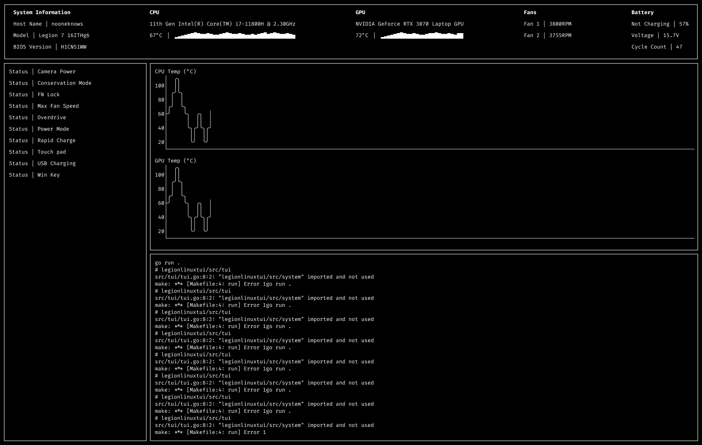

# legionlinuxtui

A terminal user interface for controlling Lenovo Legion laptops.

It utilizes the [Lenovo Legion Linux Drivers](https://github.com/johnfanv2/LenovoLegionLinux).



## Features

- Sensor information display (100ms update)
- Capability toggles; convservative mode, power mode, ...
- Logs
- Additional information

## Installation

> [!NOTE]
>
> Ensure that the [Lenovo Legion Linux Drivers](https://github.com/johnfanv2/LenovoLegionLinux)
> are installed properly on your system.

### NixOS

Soon.

## Setup

> [!NOTE]
>
> Ensure that the [Lenovo Legion Linux Drivers](https://github.com/johnfanv2/LenovoLegionLinux)
> are installed properly on your system.

> [!NOTE]
>
> Ensure Go 1.24.5 is installed.

#### Nix

> [!NOTE]
>
> Ensure [Nix](https://nixos.org/) is installed and
> [experimental features](https://nixos.wiki/wiki/Flakes) are on.

A Nix [flake](./flake.nix) development shell declaration is available in the repository.

Enter the shell using:

```sh
nix develop
```

> [!NOTE]
>
> A [`.envrc`](./.envrc) is also available in the repository for
> [`direnv`](https://github.com/direnv/direnv) users

## Build and Run

> [!NOTE]
>
> A [`Makefile`](./Makefile) is avaiable with quick commands.
>
> `make` - `go run .`
>
> `make build` - `go build -o build/`

> [!NOTE]
>
> The application needs `sudo` privileges for I/O; interacting with the drivers,
> changing values in `sysfs`

Run the application:

```sh
sudo go run .
```

or:

```
go build -o build/
sudo ./build/legionlinuxtui
```

## Contributing

Although this project is suited to my needs and wants;
add my own features and fix my own issues,
I will gladly appreciate and accept any PRs and issues that help the project.

### PRs

> [!NOTE]
>
> Ensure code is formatted with [`treefmt`](https://github.com/numtide/treefmt).
>
> A [`treefmt.toml`](./treefmt.toml) is available in the repository.

CI/CD is available, PRs will get checked for any errors before merging.

### Feedback

Leaving issues; bugs and requested features are appreciated.
They will help the project making it stable and practical as possible for others.

### TODO

I keep track of the project tasks [here](./TODO.md).

## Resources

- https://github.com/johnfanv2/LenovoLegionLinux
